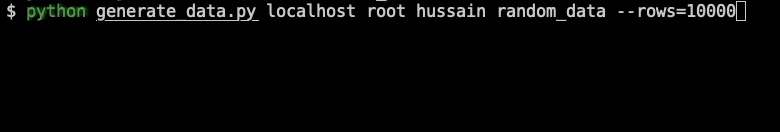

# random_data
Python script to insert random data to MySql server to performance testing purpose.

script will create a table and insert random data into the table. By default it will insert **`100000`** rows.

This value can be easily override through passing **`--rows-1000`** parameter.

## Python dependencies
   - [halo](https://github.com/manrajgrover/halo)
   - [mysql-connector-python](https://dev.mysql.com/downloads/connector/python/)
   
## Setup
### Install
Clone the git repo
```bash
git clone https://github.com/amjad489/random_data.git
```
Run the following command to install the required dependencies.
```bash
$ pip install -r requirements.txt
``` 
### Run
Pass the following parameters to run the script.
```bash
$ python generate_data.py localhost root password random_data --rows=100000
```
### Output


### Help
```bash
$ python generate_data.py                                                 
usage: Script to insert random data to Mysql database. [-h] [--rows ROWS]
                                                       host username password
                                                       database

positional arguments:
  host         database hostname/ip
  username     database username
  password     database password
  database     database name to generate random data

optional arguments:
  -h, --help   show this help message and exit
  --rows ROWS  count of rows to be inserted to database.

```

